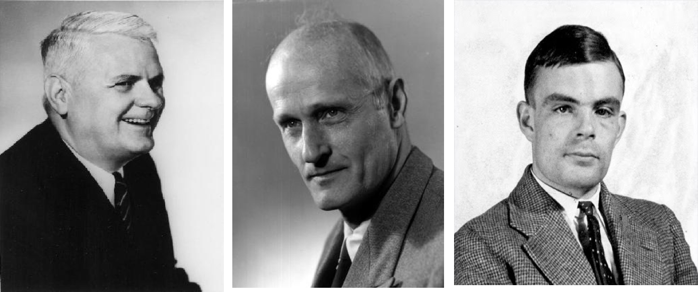
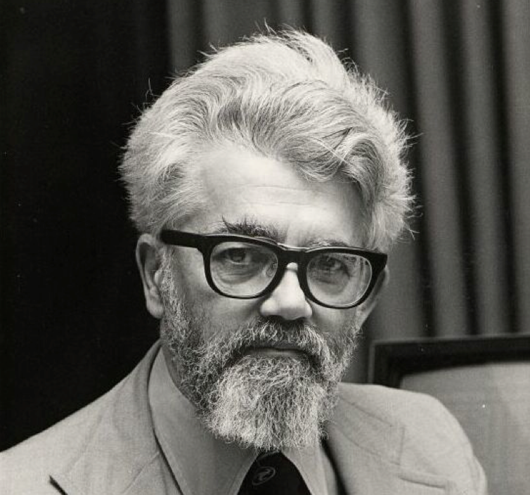
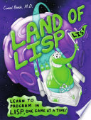

### Functional Programming Series Introduction ###

#HSLIDE

### Motivations for this series ###

- Improve the practice's knowledge base for FP
- Reduce incidental complexity in large programs
- Demonstrate new/improved "programming tools" - ie. support of concurrency
- Develop competency in Functional Programming by Practice
- Understanding the origins of FP concepts in Lisp, Javascript, Swift, Scala, C#, etc
- Fun with pair programming and learning

#VSLIDE

### What you will get ###

- Practical guidance on how to learn and apply FP practice to your work
- Support and mentoring from XM and larger community
- Prizes, glory and fame !

#VSLIDE

##### Today

- overview
- lunch !
- Clojure Introduction - Peter Mondock. XM Lead on Functional Programming Practice !
- Learn by Pairing

#VSLIDE

##### Future
- Scala
- Swift
- AWS Lambda 
- Apache Spark from Map to PMAP
- Other ?

#HSLIDE

### Historical Background & Context ###

- Important to understand the approaches taken as computers were designed
- Theory of Computation was formalized in the 1930s by several pioneers including Turing, Church, Kleene 

#VSLIDE

#VSLIDE
    - The imperative and functional models grew out of work undertaken
    Alan Turing, Alonzo Church, Stephen Kleene, Emil Post, etc. ~1930s
    different formalizations of the* notion of an algorithm*,* or *effective procedure*, based on *automata*, *symbolic manipulation*, *recursive function definitions*, and *combinatorics*
    -These results led Church to conjecture that any intuitively appealing model of computing would be equally powerful as well
    this conjecture is known as Church’s thesis
    
#VSLIDE

LIST Processor

Influenced by Church’s lambda calculus notation

Multi-paradigm, pre-fix notation

John McCarthy

#VSLIDE

Reviews
"Turns out the border between genius and insanity is a pretty cheery place."
—Paul Graham

"An excellent book for someone who wants to learn how to program."
—Slashdot

"If for no other reason, you should buy Land of Lisp because of the extreme levels of unadulterated nerdery filling its pages. This book will appeal to the long-time Lisper and the neophyte."
—Michael Fogus, author of The Joy of Clojure and Functional JavaScript

"By choosing to teach Common Lisp using 1980s style text games the author has come up with an original and clever idea that avoids all the usual boring examples found in computer language books."
—John Graham-Cumming, author of The Geek Atlas

"To be honest, I just bought the book for enjoyment but I find myself getting a new perspective and learning more about Common Lisp. Recommended!"
—Mark Watson, author of Scripting Intelligence

#HSLIDE

#### Paradigms of Programming ####

#HSLIDE

#### Functions of Functional Programming ####

#HSLIDE

#### Learning Clojure ####

# HSLIDE #

#HSLIDE

#### Some Related Links

- [GitHub: ROSE Package](https://github.com/onetapbeyond/opencpu-spark-executor)
- [GitHub: ROSE Examples](https://github.com/onetapbeyond/opencpu-spark-executor#rose-examples)
- [GitHub: opencpu-r-executor](https://github.com/onetapbeyond/opencpu-r-executor)
- [GitHub: Apache Spark](https://github.com/apache/spark)
- [Apache Spark Packages](https://spark-packages.org/package/onetapbeyond/opencpu-spark-executor)
